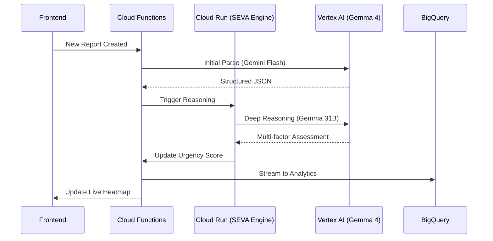

# SEVA AI: Backend Orchestration and Intelligence Layer

## Overview
The Seva AI backend is a distributed serverless architecture comprising Firebase Cloud Functions and Google Cloud Run. It serves as the "brain" of the platform, handling complex reasoning, global optimization, and predictive analytics.

## Core Services

### 1. SEVA Engine (Cloud Run)
The reasoning core of the platform, running a Node.js environment optimized for agentic workflows.
- **Advanced Reasoning**: Utilizes Gemma 4 31B via Vertex AI to process field reports.
- **Agentic Tool Calling**: The engine automatically triggers supplementary services (Weather API, Census Data) during the reasoning phase to adjust urgency scores.
- **Impact Assessment**: Analyzes compound risk factors such as "Inclement Weather + Vulnerable Population" to escalate mission priority.

### 2. Swarm Assembler (Hungarian Matching)
A high-performance matching service that ensures globally optimal volunteer dispatch.
- **Algorithm**: Implementation of the Kuhn-Munkres (Hungarian) algorithm in $O(N^3)$.
- **Cost Matrix**: Incorporates real driving distances via the Google Maps Distance Matrix API and skill compatibility penalties.
- **Global Optimization**: Unlike greedy dispatch, the Swarm Assembler minimizes the total travel time and mismatch for the *entire* community rather than just the first available report.

### 3. Urgency Decay Engine
A scheduled background process that manages the "living" aspect of the platform.
- **Escalation Logic**: Re-calculates urgency scores every 15 minutes using the formula `U = S * (1 + T/12) * Z + R + W`.
- **Automatic Escalation**: Ensures that unresolved reports in critical zones pulse with increasing intensity on the administrative heatmap.

### 4. BigQuery Analytics Pipeline
The data engineering backbone for long-term intelligence.
- **Streaming Export**: Continuous ingestion of resolved reports into BigQuery.
- **Forecasting**: BigQuery ML (ARIMA_PLUS) models that generate 72-hour crisis predictions.
- **Historical Analysis**: Aggregating data for Looker Studio embedded dashboards to measure NGO social impact.

## System Workflow

## Technical Stack
- **Firebase Functions (v2)**: Event-driven microservices.
- **Google Cloud Run**: Managed container environment for reasoning logic.
- **Vertex AI SDK**: Interaction with Gemma and Gemini models.
- **BigQuery ML**: ARIMA_PLUS time-series forecasting.
- **Google Cloud Pub/Sub**: Inter-service communication for decoupled processing.
- **Distance Matrix API**: Real-world routing intelligence.

## Operational Logic
1. **Normalization**: Every report is normalized into a standard disaster relief schema.
2. **Scoring**: Initial scoring is based on AI-detected severity.
3. **Decay**: Scores increase automatically over time if unaddressed.
4. **Matching**: Swarm Assembler triggers missions when available volunteers and open reports reach a critical density.
5. **Notification**: FCM triggers high-priority alerts to selected volunteers.
