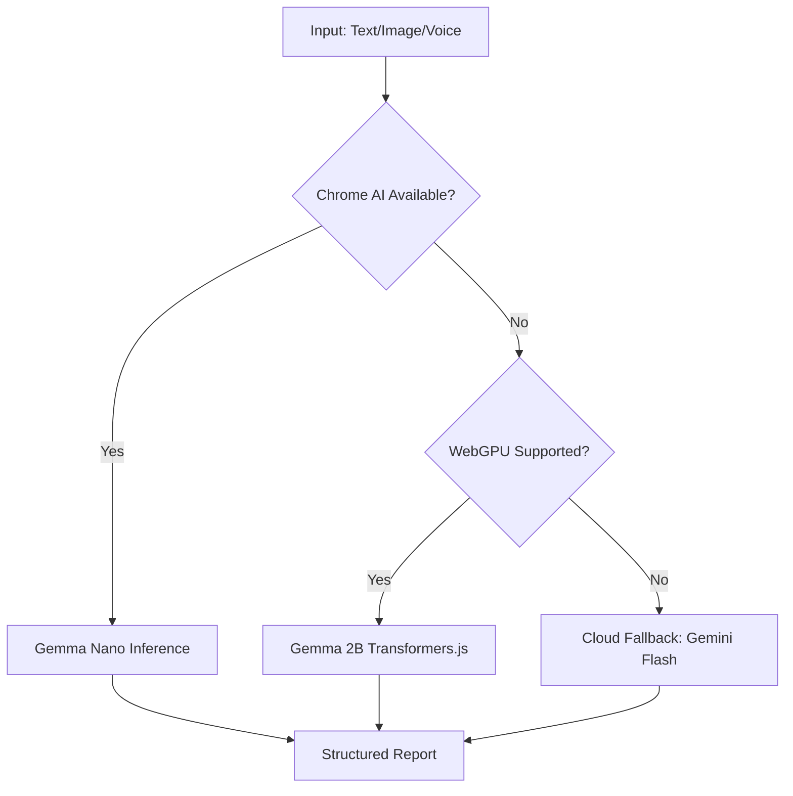

# SEVA AI: Frontend Tactical Interface and Edge Intelligence

## Overview
The Seva AI frontend is a high-performance, TypeScript-based suite of interfaces designed for NGOs, government authorities, and field volunteers. It leverages modern web standards and on-device AI to ensure high reliability even in low-connectivity disaster scenarios.

## System Layers

### 1. The Field Worker Interface (Reporter)
Optimized for mobile use, this interface handles the critical data ingestion layer.
- **Multimodal Capture**: Supports image upload for OCR and voice notes for transcription.
- **Edge AI Processing**: Utilizes a three-tier inference cascade to ensure offline reliability:
    - **Chrome Built-in AI**: Direct access to Gemma Nano for zero-latency structured data extraction.
    - **WebGPU Inference**: Fallback to Gemma 2B running via Transformers.js for devices with GPU acceleration but no built-in AI.
    - **Cloud Fallback**: Graceful transition to Gemini 1.5 Flash when connectivity is available.
- **Location Lock**: High-precision GPS capture for accurate heatmap placement.

### 2. NGO Admin Command Center
A strategic dashboard for real-time resource coordination.
- **Live Urgency Heatmap**: Built on Google Maps JS API, visualizing real-time Firestore updates through the Urgency Decay Formula.
- **Swarm Assembler Control**: Trigger for the global matching algorithm to dispatch volunteers.
- **FCM Monitoring**: Verification of active signal distribution.

### 3. Government Oversight Dashboard
A data-heavy interface for national-level impact analysis.
- **Strategic Visualization**: Recharts-based trend analysis for incident resolution rates.
- **Tactical Summarization**: One-click situation reports generated by Gemini 1.5 Pro.
- **Looker Studio Integration**: Embedded business intelligence for social impact tracking and resource gap analysis.

### 4. Volunteer PWA
A Progressive Web App designed for rapid deployment and real-time tracking.
- **FCM Push Notifications**: Foreground and background alerts for critical zone assignments.
- **GPS Telemetry**: Continuous location publishing (filtered by a 10m threshold) to power the administrative heatmap.
- **Offline Mode**: Local caching of mission data to ensure functionality during network drops.

## Technical Architecture

### Edge AI Cascade Logic

## Key Technologies
- **React 19**: Utilizing the latest concurrent rendering features.
- **TypeScript**: Ensuring strict type-safety across complex data structures.
- **Google Maps Platform**: Visualization and routing.
- **Firebase Web SDK**: Real-time synchronization and authentication.
- **WebGPU**: Powering on-device large language models.
- **Material UI + Vanilla CSS**: Premium tactical dark-mode aesthetics.

## Environment Configuration
The following variables are required for full functionality:
- `VITE_GOOGLE_MAPS_API_KEY`: Maps rendering and Distance Matrix.
- `VITE_FIREBASE_VAPID_KEY`: Web push notifications.
- `VITE_GEMINI_API_KEY`: Multimodal cloud parsing.
- `VITE_LOOKER_STUDIO_URL`: Analytics dashboard embed.

## Performance Standards
- **Inference Latency**: Target < 800ms for on-device Gemma Nano processing.
- **State Sync**: Firestore snapshot updates reflecting on the heatmap in < 2 seconds.
- **Bundle Optimization**: Tree-shaking and dynamic imports for Edge AI models to maintain fast TTI.
