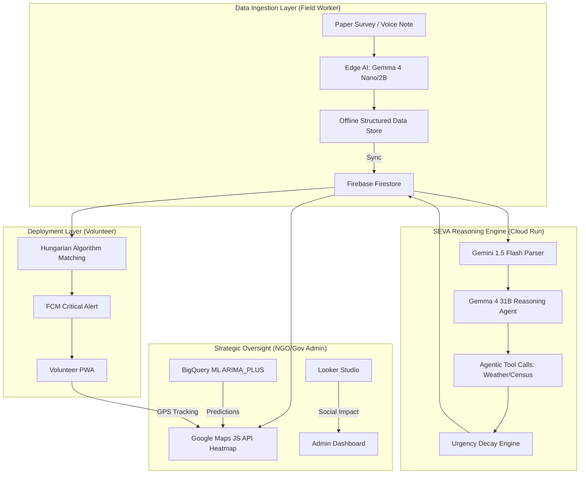

# SEVA AI: Data-Driven Disaster Response and Resource Coordination

## Project Overview
SEVA AI is an advanced emergency response and resource allocation platform developed for the Google Solution Challenge 2026. The system addresses the critical gap in disaster management where localized community needs are often scattered across disparate formats (paper surveys, voice notes, field reports) and lack a unified, real-time visualization layer for effective NGO and government response.

## Problem Statement
In disaster-prone regions and marginalized communities, social groups and NGOs collect vast amounts of data regarding community needs. However, this data is frequently siloed in paper-based reports or unstructured digital formats. This lack of centralized, real-time intelligence leads to:
1. Delayed response times to life-threatening emergencies.
2. Sub-optimal volunteer distribution (greedy vs. global optimization).
3. Inability to predict crisis escalation before it occurs.
4. Dependency on internet connectivity in areas where infrastructure is compromised.

## Solution: The SEVA Ecosystem
SEVA AI provides a four-tier tactical infrastructure that transforms unstructured field data into globally optimal rescue and relief operations.

1. **Edge AI Data Ingestion**: Field workers can capture reports via OCR or voice even in offline environments using on-device Gemma 4 models (WebGPU/Chrome AI).
2. **SEVA Reasoning Engine**: A high-performance Cloud Run environment utilizing Gemma 4 31B on Vertex AI for agentic reasoning and multi-factor risk assessment.
3. **Tactical Command Center**: A real-time administrative dashboard featuring a Google Maps-based live urgency heatmap with BigQuery ML predictive forecasting.
4. **Optimized Dispatch**: A volunteer deployment PWA that utilizes the Hungarian Algorithm to ensure globally optimal resource matching based on skills, distance, and urgency.

## System Architecture

## Core Algorithms

### 1. Urgency Decay Formula (UDF)
The platform uses a dynamic scoring model that ensures unattended reports escalate in priority automatically.
**Formula:** `U = S * (1 + T / 12) * Z + R + W`
- `S`: Base Severity (1-5) extracted by AI.
- `T`: Time elapsed in hours since submission.
- `Z`: Zone Density (1.0 Rural, 1.5 Urban, 2.0 High-Density).
- `R`: Repeat Report Bonus (incremented for duplicate reports).
- `W`: Weather Risk factor (Real-time data from Open-Meteo).

### 2. Hungarian Algorithm (Kuhn-Munkres)
Unlike greedy matching which assigns the first available volunteer, SEVA AI implements the Hungarian Algorithm ($O(N^3)$) to minimize the global cost of the entire mission set. Cost is calculated as a weighted matrix of:
- **70% Proximity**: Real driving distance via Google Maps Distance Matrix API.
- **30% Skill Match**: Similarity between volunteer skills and report requirements.

### 3. BigQuery ML Crisis Forecasting
The system utilizes the `ARIMA_PLUS` time-series model to predict "Future Red Zones." By analyzing historical urgency trends across geohashes, the map displays dashed-border regions where a crisis is predicted to escalate within the next 24-72 hours.

## Technology Stack

### Google Cloud Platform
- **Vertex AI**: Hosting Gemma 4 31B for reasoning and Gemini 1.5 Flash for multimodal parsing.
- **Cloud Run**: Scaling the SEVA Engine and matching logic.
- **BigQuery**: Real-time analytics and ML forecasting.
- **Firestore**: Real-time NoSQL database for system synchronization.
- **Cloud Functions**: Event-driven triggers for data enrichment.
- **Looker Studio**: Embedded social impact visualizations.

### Maps and Location
- **Google Maps JS API**: Visualization layer for tactical heatmaps.
- **Distance Matrix API**: Real-world travel time calculations for dispatch.
- **Geolocation API**: Continuous field worker and volunteer tracking.

### Frontend and PWA
- **React 19 + TypeScript**: Core application framework.
- **WebGPU**: Accelerated local AI inference.
- **Firebase Cloud Messaging**: High-priority push notifications.

## Repository Structure
- `/Frontend`: React-based dashboards and PWA interfaces.
- `/Backend`: Firebase Cloud Functions and Cloud Run microservices.
- `/docs`: Detailed architectural specifications and logic diagrams.
